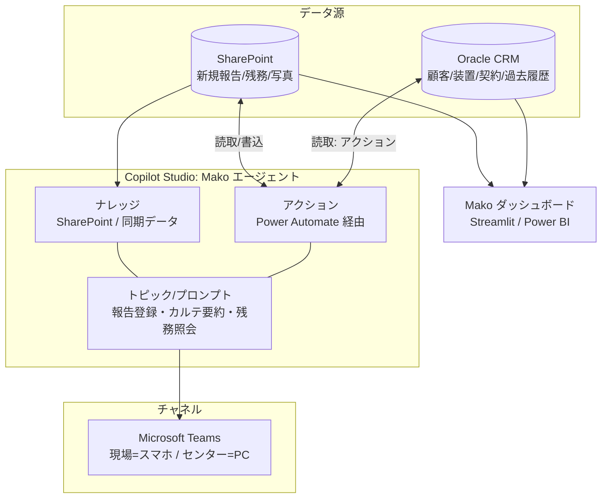

# Copilot Studio を使う場合の設計（トライアル向け）

来月の **Copilot Studio トライアル**で試すことを想定した設計。
今の「ダッシュボードで見る」に、**Teams で話す・聞くエージェント**が加わり、
入力・閲覧・要約・自動化がぐっと楽になる。

> 前提：Oracle CRM に DB 直結可（顧客・装置・契約・過去履歴）、
> 新規の現場報告・残務は Microsoft Forms / SharePoint、閲覧者は Claude 等の外部アカウント無し。

---

## 1. 何が変わるか（要点）

| | 今（Forms＋ダッシュボード） | Copilot Studio 追加後 |
|---|---|---|
| 入力 | Forms の項目に音声で入力 | **Teams で会話しながら登録**（音声可）。エージェントが項目に整理 |
| 閲覧 | ダッシュボードを操作 | **自然文で質問→引用付き回答**（+ダッシュボードは全体俯瞰用に併存） |
| 要約 | Copilotチャットで半自動 | **登録時に自動生成**して保存 |
| 気づき | 人が一覧を見る | **点検期限・未対応残務を自動リマインド** |

「見る（ダッシュボード）」と「話す・聞く（エージェント）」は**同じデータ源**（CRM＋SharePoint）を
見るので、二重管理は起きない。

---

## 2. 全体構成



- **ナレッジ（Knowledge）**：生成回答（検索して答える）に使う。SharePoint はネイティブ対応。
  CRM の広い横断検索が必要なら、CRM を Dataverse / SharePoint に同期してナレッジ化する。
- **アクション（Actions）**：特定レコードの取得・書込は Power Automate フローを
  エージェントの「アクション」として登録して呼ぶ（例：装置IDでカルテ取得、報告をSharePoint保存）。
- **トピック/プロンプト**：会話の型（報告登録、カルテ要約、残務照会）とAIプロンプト。

> ポイント：**「広く探して答える」はナレッジ**、**「この装置の正確な履歴を出す/書き込む」はアクション**、と使い分ける。

---

## 3. 3つの使い方（ユースケース）

### UC1. 現場で「話して登録」
1. 現場エンジニアが Teams で Mako エージェントに話す（音声可）
   例：「さくら総合病院のMRI、緊急対応の報告。RFコイルのコネクタ接触不良で…対応は清掃と再固定…」
2. エージェントが対応区分・作業内容・不具合・対応・部品などの**項目に整理**して確認画面を出す
3. 写真を添付 → 「これで登録」で**アクションが SharePoint に保存**（装置IDに紐付け）
4. 続けて「次回コイルケーブル交換を残務に」と言えば**残務も起票**

> Forms より速く、手が離せない現場でも音声で完結。項目の抜けはエージェントが聞き返す。

### UC2. カルテを「聞いて把握」
- 「さくら総合病院のMRIの前回の対応は？」
- 「保育器の未対応の残務は？期限は？」
- 「この装置で過去に多い不具合は？」
- 「来週点検が近い装置を教えて」

→ CRM（過去履歴・契約）＋SharePoint（新規）を根拠に、**引用付きで回答**。
サービスセンターの人も Teams で同じように聞ける。訪問前の下調べが数秒。

### UC3. 自動まとめ・自動通知（autonomous）
- 新規報告が登録されたら **カルテ要約を自動生成**して保存（段階2）
- **次回点検が近い／未対応残務が期限超過**の装置を検知して、担当者へ Teams で通知
- 週次で「今週の要対応まとめ」を担当チームに投稿

---

## 4. Mako エージェントの中身（そのまま使える下書き）

### エージェントの説明（instructions）例
```
あなたは医療機器のフィールドサービスを支援するアシスタント「Mako」です。
対象は病院にある装置1台ごとの「カルテ」（顧客・装置・契約・作業/対応履歴・残務）。
- 質問には、CRMとSharePointの記録を根拠に、事実のみで簡潔に答える（推測しない、出典を示す）。
- 報告登録の依頼では、対応区分/作業内容/不具合/対応/使用部品/結果/申し送り の項目に整理し、
  不足は質問して補い、確認を取ってからアクションで保存する。
- 医療現場向けのため、安全に関わる残務（NICU等）は優先度と期限を必ず確認する。
```

### アクション（Power Automate フローとして用意）
| アクション | 入力 | 動作 |
|---|---|---|
| カルテ取得 | 装置ID or 顧客名＋装置名 | Oracle＋SharePoint から履歴・残務を返す |
| 報告登録 | 装置ID＋各項目＋写真 | SharePoint の新規報告リストに保存 |
| 残務登録 | 装置ID＋内容＋期限＋優先度 | SharePoint の残務リストに保存 |
| カルテ要約 | 装置ID | 履歴を要約プロンプトに通し、要約を保存・返却 |

### 要約プロンプト（UC3／段階2で使用）
```
次は医療機器1台の作業・対応履歴です。次の担当者が短時間で把握できるよう、
【現状】【繰り返す事象・注意点】【未対応の残務】【次回の推奨アクション】の4見出しで
各2〜4行、日本語で簡潔に要約してください。記録の事実のみ、推測はしないこと。
```

---

## 5. トライアルでの検証順（おすすめ）

小さく始めて、効くところから広げる。

1. **「聞く」を体験**：SharePoint（＋サンプル）をナレッジにして、UC2 の質問応答を試す
   → まず「引用付きで正しく答えられるか」を確認（一番効果を感じやすい）
2. **アクションで「正確なカルテ取得」**：装置IDでの履歴取得フローをアクション化
3. **「要約」**：新規報告→要約自動生成（UC3の一部）
4. **「話して登録」**：会話フローで報告作成→保存（UC1）
5. **「自動通知」**：残務・点検リマインド（autonomous、最後に）

---

## 6. トライアルで確認するチェックリスト

- [ ] **Oracle 接続**：Power Automate の Oracle コネクタ（or カスタムコネクタ）を
      エージェントのアクションから呼べるか
- [ ] **SharePoint ナレッジ**：SharePoint をナレッジに追加し、生成回答が引用付きで出るか
- [ ] **アクション**：Power Automate フローをエージェントのアクションとして登録・実行できるか
- [ ] **Teams 公開**：エージェントを Teams に公開でき、**スマホで音声入力**できるか
- [ ] **権限・データ境界**：誰がどの顧客のカルテを見れるか（顧客ごとのアクセス制御）
- [ ] **自動化（autonomous）**：イベント（新規報告・期限接近）でフローを起動できるか
- [ ] **要約品質**：要約プロンプトの出力が現場の申し送りとして妥当か

---

## 7. この試作との関係

- **ダッシュボード（`app/` Streamlit・`web/` Web）** … 「見る（全体俯瞰・カルテの時系列・残務ボード）」を担当。継続利用。
- **Copilot Studio エージェント** … 「話す（登録）・聞く（照会）・自動化（要約/通知）」を担当。
- 両者は**同じデータ源（Oracle CRM ＋ SharePoint）**を参照するので役割分担するだけ。
  トライアルで手応えがあれば、入力・閲覧の主役を徐々にエージェント側へ寄せていける。

> 関連：全体のデータ設計・Forms/SharePoint・Oracle直結は
> [forms-and-flow.md](forms-and-flow.md) を参照。
