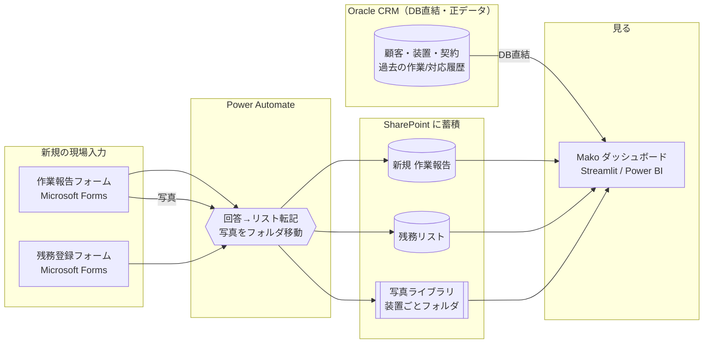

# 集める → 貯める → 見る：連携設計（Microsoft 365）

現場でスマホ入力（**Microsoft Forms**）→ 会社に構造的に蓄積（**SharePoint リスト**）→
PC/スマホで閲覧（**ダッシュボード**）を、一本につなぐための設計書です。
実装はこの順（マスタ → Forms → SharePoint → Power Automate → ダッシュボード）で進めます。

### 使う環境（前提・確認済み）
- **Oracle CRM に DB 直接接続できる**。CRM には次まで入っている：
  **顧客・設置先／装置・型番・SN／契約・保守情報／過去の作業・対応履歴**。
  → **カルテの「過去履歴・装置情報・契約」は CRM が正**。新規の現場報告だけ Forms で足す。
- **AI は Copilot チャットのみ**（現時点）。AI Builder / Copilot Studio を
  Power Automate から呼べるかは未確認 → **フロー内の自動要約は当面見送り**、§5の現実解で対応。
- **入力/蓄積/自動化/閲覧**：Microsoft 365（Forms / SharePoint / Power Automate）。

### データの出どころ（どこが正か）
| データ | 出どころ（正） | 取り込み |
|---|---|---|
| 顧客・設置先 | Oracle CRM | DB直結（同期 or 直参照） |
| 装置・型番・SN・設置場所 | Oracle CRM | DB直結 |
| 契約・保守・次回点検 | Oracle CRM | DB直結 |
| 過去の作業・対応履歴 | Oracle CRM | DB直結 |
| **新規の現場報告（音声＋写真）** | **Microsoft Forms → SharePoint** | Power Automate |
| **残務・頼まれごと** | Microsoft Forms → SharePoint | Power Automate |
| 作業員（顔写真） | M365 / 人事 | Entra ID 等 |

> ダッシュボードは **CRM（過去履歴・装置・契約）＋ SharePoint（新規報告・残務・写真）** を
> 統合して1台のカルテとして表示する。過去はCRM、これからはForms、が一本の時系列で並ぶ。



---

## 0. データの考え方（＝カルテ構造）

```
病院(Hospital) ─┬─ 装置(Device) ─┬─ 作業報告(Report)  … 装置1台の履歴＝カルテ本体
                │                └─ 残務(Task)
作業員(Engineer) が各報告・残務を担当
```

この構造をそのまま SharePoint の **5つのリスト**にします。
Forms の質問項目は、下記リストの列に1対1で対応させます。

---

## 1. マスタ（顧客・装置は Oracle CRM が正）

現場の人が「選ぶだけ」で入力できるよう、顧客/病院・装置・作業員をマスタ化します。
**顧客・装置は Oracle CRM が正データ**なので、手入力せず CRM から取り込みます（§1-4）。
作業員マスタは M365（Entra ID）や人事情報から。

下記は SharePoint 側に持つ場合の列定義です（CRM を直接参照する構成でも列の考え方は同じ）。

### 病院マスタ（SharePoint リスト: `Hospitals`）
| 列 | 型 | 例 |
|---|---|---|
| 病院ID (Title) | 1行テキスト | H01 |
| 病院名 | 1行テキスト | さくら総合病院 |
| 住所 | 1行テキスト | 東京都千代田区丸の内1-9-1 |
| 緯度 | 数値 | 35.6812 |
| 経度 | 数値 | 139.7671 |
| 連絡先 | 1行テキスト | 医療技術部 放射線科 03-1234-5678 |

> 緯度経度は Google マップ表示に使用。住所しか無い場合は Power Automate や
> ダッシュボード側で住所→座標変換（ジオコーディング）してもよい。

### 装置マスタ（SharePoint リスト: `Devices`）＝カルテの対象
| 列 | 型 | 例 |
|---|---|---|
| 装置ID (Title) | 1行テキスト | D-MRI-01 |
| 病院ID | 参照(Hospitals) | H01 |
| 装置名 | 1行テキスト | MRI装置 |
| 型番 | 1行テキスト | SIGNA Explorer 1.5T |
| 製造番号(SN) | 1行テキスト | MR15-88213 |
| 設置場所 | 1行テキスト | 放射線科 MRI室 |
| 設置日 | 日付 | 2021-04-10 |
| 次回点検 | 日付 | 2026-10-15 |

### 作業員マスタ（SharePoint リスト: `Engineers`）
| 列 | 型 | 例 |
|---|---|---|
| 社員ID (Title) | 1行テキスト | E01 |
| 氏名 | 1行テキスト | 佐藤 健一 |
| チーム | 1行テキスト | 画像診断チーム |
| 顔写真 | 画像 / ハイパーリンク | （社員名簿の写真URL） |

### 1-4. Oracle CRM の読み込み（DB直結）
DB 直接接続が可能なので、**ダッシュボードから Oracle を直接読む（直参照）**を基本にする。
顧客・装置・契約・過去履歴は CRM が常に正となり、二重管理が起きない。

- **実装**：Streamlit版で `python-oracledb` を使い、CRM のテーブルを SQL で取得。
  雛形を **`app/data_oracle.py`** に用意（テーブル名・列名は実スキーマに合わせて差し替え）。
  環境変数 `MAKO_SOURCE=oracle` で、サンプルJSONの代わりに Oracle を読む。
- **性能・負荷が気になる場合**：CRM を1日数回 SharePoint / ローカルにキャッシュ同期して読む構成も可。
  まずは直参照で始め、必要になったらキャッシュ層を足す。

> 次に必要：CRM の**実テーブル名・列名**（顧客／装置／契約／作業履歴）。これがあれば
> `data_oracle.py` の SQL を実物に合わせて完成できます。

---

## 2. 集める：Microsoft Forms

### 2-1. 作業報告フォーム
| 質問 | Forms種別 | 必須 | → SharePoint列(作業報告リスト) |
|---|---|---|---|
| 病院 | 選択肢（ドロップダウン） | ✓ | 病院ID |
| 装置 | 選択肢（ドロップダウン） | ✓ | 装置ID |
| 担当者 | 選択肢 | ✓ | 社員ID |
| 対応区分 | 選択肢（定期点検/修理/緊急対応/設置・初期点検） | ✓ | 対応区分 |
| 作業内容 | 記述（長文） | ✓ | 作業内容 |
| 発生した事象・不具合 | 記述（長文） |  | 事象 |
| 対応・処置 | 記述（長文） |  | 対応 |
| 使用・交換部品 | 記述 |  | 部品 |
| 結果・動作確認 | 記述（長文） |  | 結果 |
| 次回への申し送り | 記述（長文） |  | 申し送り |
| 写真 | ファイルのアップロード（複数可） |  | （→写真ライブラリへ） |
| 顧客からの頼まれごと（あれば） | 記述 |  | （→残務リストへ起票） |

> **音声入力**：現場ではスマホのキーボードの音声入力（マイクボタン）で
> 記述欄にそのまま話して入力できます。特別な設定は不要です。

### 2-2. 残務登録フォーム（頼まれごと専用・短い）
| 質問 | Forms種別 | 必須 | → SharePoint列(残務リスト) |
|---|---|---|---|
| 病院 | 選択肢 | ✓ | 病院ID |
| 装置 | 選択肢 | ✓ | 装置ID |
| 内容 | 記述 | ✓ | 内容 |
| 期限 | 日付 |  | 期限 |
| 優先度 | 選択肢（高/中/低） | ✓ | 優先度 |
| 担当 | 選択肢 |  | 社員ID |
| メモ | 記述 |  | メモ |

### Forms のドロップダウンについて（重要な制約）
Microsoft Forms の選択肢は**静的**で、装置マスタと自動連動しません。運用案：
- **案A（手軽）**：選択肢を手動でメンテ。病院・装置が少ないうちはこれで十分。
- **案B（推奨・拡張時）**：入力を **Power Apps** 化し、SharePoint マスタから
  動的にドロップダウンを生成。病院を選ぶと装置が絞り込まれる、まで作れる。
- 当面は Forms（案A）で始め、規模が増えたら Power Apps（案B）へ移行。

---

## 3. 貯める：SharePoint（回答が溜まる先）

### 作業報告リスト（`WorkReports`）
| 列 | 型 |
|---|---|
| 報告ID (Title) | 自動採番 or 数式（例: R-2026-####） |
| 受付日時 | 日付+時刻（回答日時） |
| 病院ID / 装置ID / 社員ID | 参照 |
| 対応区分 | 選択肢 |
| 作業内容 / 事象 / 対応 / 部品 / 結果 / 申し送り | テキスト（長文） |
| 写真フォルダ | ハイパーリンク（写真ライブラリの該当フォルダ） |
| AI要約 | テキスト（長文）※任意・後述 |

### 残務リスト（`Tasks`）
| 列 | 型 |
|---|---|
| 残務ID (Title) | 自動採番 |
| 病院ID / 装置ID / 社員ID(担当) | 参照 |
| 内容 / メモ | テキスト |
| 依頼日 / 期限 | 日付 |
| 状態 | 選択肢（未対応/対応中/完了） |
| 優先度 | 選択肢（高/中/低） |
| 関連報告ID | 参照(WorkReports) |

### 写真ライブラリ（`WorkPhotos`）
- ドキュメントライブラリ。フォルダ構成は **`/装置ID/報告ID/`**。
- 例：`/D-MRI-01/R-2026-0021/coil_connector.jpg`
- こうすると「装置カルテ」で装置IDから写真をたどれる。

---

## 4. 整理：Power Automate（自動転記）

### フロー①：作業報告フォーム → リスト＋写真
1. **トリガー**：`Microsoft Forms - 新しい応答が送信されたとき`（作業報告フォーム）
2. `応答の詳細を取得する`
3. `SharePoint - 項目の作成`（WorkReports に各回答をマッピング）
4. 写真：`応答の詳細`のファイル添付を取得 → `SharePoint - ファイルの作成`で
   `/装置ID/報告ID/` フォルダへ保存（フォルダが無ければ作成）
5. 「頼まれごと」欄に入力があれば、`Tasks` に項目を作成（状態=未対応）
6. （任意）フロー②のAI要約を呼ぶ

### フロー②：残務フォーム → 残務リスト
1. トリガー：残務フォームの新規応答
2. `SharePoint - 項目の作成`（Tasks に、状態=未対応 で作成）

---

## 5. AI要約の入れ方（会社利用では「保存型」が正解）

> **重要**：閲覧するのは社内の人・サービスセンターの人で、**個々に Claude アカウントは無い**。
> よって「閲覧者のアカウントで都度生成する方式」は本番には使えない。
> **要約は登録時に1回だけ生成して SharePoint に保存し、閲覧者は読むだけ**にする。

**現状の制約**：使える AI は **Copilot チャットのみ**。Copilot チャットは
Power Automate から自動で呼べる API ではないため、**「登録時にフローで自動要約」は今はできない**。
そこで、段階を踏む。

### 段階1（今すぐ）：Copilot チャットで半自動生成 → 保存
- 決まったプロンプトを用意し、カルテの履歴テキストを貼って Copilot チャットで要約 → 結果を
  `WorkReports.AI要約` / カルテのサマリー欄に貼る（担当者またはコーディネーターが実施）。
- **保存プロンプト（コピペ用）**：
  > 次は医療機器1台の作業・対応履歴です。次の担当者が短時間で把握できるよう、
  > 【現状】【繰り返す事象・注意点】【未対応の残務】【次回の推奨アクション】の4見出しで
  > 各2〜4行、日本語で簡潔に要約してください。記録の事実のみ、推測はしないこと。
- 閲覧者はアカウント不要で保存済みを読むだけ（試作 `web/index.html` はこの見え方）。

### 段階2（自動化・要ライセンス確認）：フローで自動要約
- **AI Builder（GPTプロンプト）** か **Copilot Studio** が Power Automate から使えれば、
  段階1を自動化して登録時に要約を生成・保存できる（外部API不要・テナント内で完結）。
- まず情報システム部門に「AI Builder / Copilot Studio を Power Automate から使えるか」を確認。
  使えれば段階2へ、難しければ段階1の運用を続ける。

> **Copilot Studio が使える場合**は、要約の自動化にとどまらず、Teams で
> 「話して登録・聞いて把握・自動通知」まで広がる。設計は
> [copilot-studio-design.md](copilot-studio-design.md) を参照。

> **まとめ**：要約の**見せ方（保存して誰でも閲覧）は確定**。**作り方**だけ、
> 当面はCopilotチャットで半自動（段階1）→ ライセンス確認できたら自動化（段階2）。

---

## 6. 見る：ダッシュボード接続

蓄積した SharePoint データを、いまの試作ダッシュボードにつなぐ。

- **Streamlit版（`app/`）**：2つの源を統合して読む。
  - **Oracle CRM（直結）**：`app/data_oracle.py`（雛形あり）の SQL を実スキーマに合わせ、
    `MAKO_SOURCE=oracle` で顧客・装置・契約・過去履歴を取得。
  - **SharePoint（新規報告・残務・写真）**：Microsoft Graph API で取得し、CRM 履歴と統合。
  - どちらも `data.py` が期待する列名に合わせれば、画面はそのまま動く。
- **Web版（`web/index.html`）**：社内公開する場合は、SharePoint から書き出した
  JSON を読む形にするか、SharePoint Framework(SPFx) Web パーツ化。
- **手軽な代替**：SharePoint リストビュー / **Power BI** でも一覧・集計は可能。
  「装置カルテ」の時系列ビューが要るならダッシュボードアプリが適する。

---

## 7. 段階的な進め方（おすすめ順）

1. **Oracle 直結**：`app/data_oracle.py` の SQL を実スキーマに合わせ、CRM の顧客・装置・契約・過去履歴を表示（`MAKO_SOURCE=oracle`）
2. **作業報告フォーム**＋ Power Automate で `WorkReports`（新規報告）へ転記（写真も）
3. **残務フォーム**＋ `Tasks` 転記
4. ダッシュボードで **CRM履歴＋新規報告** を統合表示
5. **AI要約 段階1**：Copilot チャット＋保存プロンプトで半自動生成し、サマリー欄に保存
6. **AI要約 段階2**：AI Builder/Copilot Studio が使えるか確認 → 使えれば自動化
7. 規模拡大時は入力を **Power Apps** 化（動的ドロップダウン）

---

## 付録：サンプルデータとの対応
この設計の列名は、試作の `app/sample_data/*.json` のキーと一致させています。
そのため、SharePoint から同じ形の JSON を吐ければ `app/data.py` の差し替えは最小で済みます。
