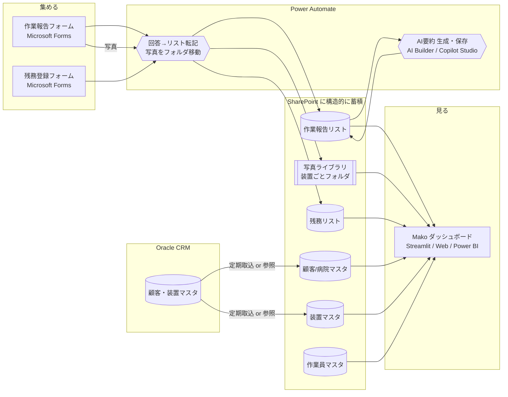

# 集める → 貯める → 見る：連携設計（Microsoft 365）

現場でスマホ入力（**Microsoft Forms**）→ 会社に構造的に蓄積（**SharePoint リスト**）→
PC/スマホで閲覧（**ダッシュボード**）を、一本につなぐための設計書です。
実装はこの順（マスタ → Forms → SharePoint → Power Automate → ダッシュボード）で進めます。

### 使う環境（前提）
- **AI**：**Copilot Enterprise**（キヤノン側テナント）。自動要約はフロー内の
  **AI Builder（GPTプロンプト）／ Copilot Studio** を利用（＝同じテナント・データ境界内）。
- **CRM（顧客・装置マスタ）**：**Oracle CRM** から取り込む（両社の社員が取得可能）。
- **入力/蓄積/自動化/閲覧**：Microsoft 365（Forms / SharePoint / Power Automate）。



---

## 0. データの考え方（＝カルテ構造）

```
病院(Hospital) ─┬─ 装置(Device) ─┬─ 作業報告(Report)  … 装置1台の履歴＝カルテ本体
                │                └─ 残務(Task)
作業員(Engineer) が各報告・残務を担当
```

この構造をそのまま SharePoint の **5つのリスト**にします。
Forms の質問項目は、下記リストの列に1対1で対応させます。

---

## 1. マスタ（顧客・装置は Oracle CRM が正）

現場の人が「選ぶだけ」で入力できるよう、顧客/病院・装置・作業員をマスタ化します。
**顧客・装置は Oracle CRM が正データ**なので、手入力せず CRM から取り込みます（§1-4）。
作業員マスタは M365（Entra ID）や人事情報から。

下記は SharePoint 側に持つ場合の列定義です（CRM を直接参照する構成でも列の考え方は同じ）。

### 病院マスタ（SharePoint リスト: `Hospitals`）
| 列 | 型 | 例 |
|---|---|---|
| 病院ID (Title) | 1行テキスト | H01 |
| 病院名 | 1行テキスト | さくら総合病院 |
| 住所 | 1行テキスト | 東京都千代田区丸の内1-9-1 |
| 緯度 | 数値 | 35.6812 |
| 経度 | 数値 | 139.7671 |
| 連絡先 | 1行テキスト | 医療技術部 放射線科 03-1234-5678 |

> 緯度経度は Google マップ表示に使用。住所しか無い場合は Power Automate や
> ダッシュボード側で住所→座標変換（ジオコーディング）してもよい。

### 装置マスタ（SharePoint リスト: `Devices`）＝カルテの対象
| 列 | 型 | 例 |
|---|---|---|
| 装置ID (Title) | 1行テキスト | D-MRI-01 |
| 病院ID | 参照(Hospitals) | H01 |
| 装置名 | 1行テキスト | MRI装置 |
| 型番 | 1行テキスト | SIGNA Explorer 1.5T |
| 製造番号(SN) | 1行テキスト | MR15-88213 |
| 設置場所 | 1行テキスト | 放射線科 MRI室 |
| 設置日 | 日付 | 2021-04-10 |
| 次回点検 | 日付 | 2026-10-15 |

### 作業員マスタ（SharePoint リスト: `Engineers`）
| 列 | 型 | 例 |
|---|---|---|
| 社員ID (Title) | 1行テキスト | E01 |
| 氏名 | 1行テキスト | 佐藤 健一 |
| チーム | 1行テキスト | 画像診断チーム |
| 顔写真 | 画像 / ハイパーリンク | （社員名簿の写真URL） |

### 1-4. Oracle CRM からの取り込み
顧客・装置マスタは Oracle CRM から取得（両社の社員が取得可能とのこと）。実装の選択肢：

- **案ア（自動・推奨）**：Power Automate の **Oracle Database コネクタ**で CRM を定期取得し、
  SharePoint の `Hospitals` / `Devices` リストへ upsert（1日1回など）。ダッシュボードは SharePoint を読む。
- **案イ（手軽）**：現状「両社の社員ができる」CRM エクスポート（CSV等）を所定フォルダに置き、
  Power Automate（または取込スクリプト）で SharePoint へ反映。まずはこれで開始も可。
- **案ウ（直参照）**：ダッシュボード（Streamlit版）から Oracle を直接読む。CRM が常に正になるが、
  DB 接続情報・権限管理が必要。

> 確認したい点：CRM から引ける具体的な項目（顧客・装置・型番・SN・設置場所・契約情報など）と、
> 取得方法（Oracleへ直接接続できるのか／エクスポート運用か）。ここが決まると取り込み方式を確定できます。

---

## 2. 集める：Microsoft Forms

### 2-1. 作業報告フォーム
| 質問 | Forms種別 | 必須 | → SharePoint列(作業報告リスト) |
|---|---|---|---|
| 病院 | 選択肢（ドロップダウン） | ✓ | 病院ID |
| 装置 | 選択肢（ドロップダウン） | ✓ | 装置ID |
| 担当者 | 選択肢 | ✓ | 社員ID |
| 対応区分 | 選択肢（定期点検/修理/緊急対応/設置・初期点検） | ✓ | 対応区分 |
| 作業内容 | 記述（長文） | ✓ | 作業内容 |
| 発生した事象・不具合 | 記述（長文） |  | 事象 |
| 対応・処置 | 記述（長文） |  | 対応 |
| 使用・交換部品 | 記述 |  | 部品 |
| 結果・動作確認 | 記述（長文） |  | 結果 |
| 次回への申し送り | 記述（長文） |  | 申し送り |
| 写真 | ファイルのアップロード（複数可） |  | （→写真ライブラリへ） |
| 顧客からの頼まれごと（あれば） | 記述 |  | （→残務リストへ起票） |

> **音声入力**：現場ではスマホのキーボードの音声入力（マイクボタン）で
> 記述欄にそのまま話して入力できます。特別な設定は不要です。

### 2-2. 残務登録フォーム（頼まれごと専用・短い）
| 質問 | Forms種別 | 必須 | → SharePoint列(残務リスト) |
|---|---|---|---|
| 病院 | 選択肢 | ✓ | 病院ID |
| 装置 | 選択肢 | ✓ | 装置ID |
| 内容 | 記述 | ✓ | 内容 |
| 期限 | 日付 |  | 期限 |
| 優先度 | 選択肢（高/中/低） | ✓ | 優先度 |
| 担当 | 選択肢 |  | 社員ID |
| メモ | 記述 |  | メモ |

### Forms のドロップダウンについて（重要な制約）
Microsoft Forms の選択肢は**静的**で、装置マスタと自動連動しません。運用案：
- **案A（手軽）**：選択肢を手動でメンテ。病院・装置が少ないうちはこれで十分。
- **案B（推奨・拡張時）**：入力を **Power Apps** 化し、SharePoint マスタから
  動的にドロップダウンを生成。病院を選ぶと装置が絞り込まれる、まで作れる。
- 当面は Forms（案A）で始め、規模が増えたら Power Apps（案B）へ移行。

---

## 3. 貯める：SharePoint（回答が溜まる先）

### 作業報告リスト（`WorkReports`）
| 列 | 型 |
|---|---|
| 報告ID (Title) | 自動採番 or 数式（例: R-2026-####） |
| 受付日時 | 日付+時刻（回答日時） |
| 病院ID / 装置ID / 社員ID | 参照 |
| 対応区分 | 選択肢 |
| 作業内容 / 事象 / 対応 / 部品 / 結果 / 申し送り | テキスト（長文） |
| 写真フォルダ | ハイパーリンク（写真ライブラリの該当フォルダ） |
| AI要約 | テキスト（長文）※任意・後述 |

### 残務リスト（`Tasks`）
| 列 | 型 |
|---|---|
| 残務ID (Title) | 自動採番 |
| 病院ID / 装置ID / 社員ID(担当) | 参照 |
| 内容 / メモ | テキスト |
| 依頼日 / 期限 | 日付 |
| 状態 | 選択肢（未対応/対応中/完了） |
| 優先度 | 選択肢（高/中/低） |
| 関連報告ID | 参照(WorkReports) |

### 写真ライブラリ（`WorkPhotos`）
- ドキュメントライブラリ。フォルダ構成は **`/装置ID/報告ID/`**。
- 例：`/D-MRI-01/R-2026-0021/coil_connector.jpg`
- こうすると「装置カルテ」で装置IDから写真をたどれる。

---

## 4. 整理：Power Automate（自動転記）

### フロー①：作業報告フォーム → リスト＋写真
1. **トリガー**：`Microsoft Forms - 新しい応答が送信されたとき`（作業報告フォーム）
2. `応答の詳細を取得する`
3. `SharePoint - 項目の作成`（WorkReports に各回答をマッピング）
4. 写真：`応答の詳細`のファイル添付を取得 → `SharePoint - ファイルの作成`で
   `/装置ID/報告ID/` フォルダへ保存（フォルダが無ければ作成）
5. 「頼まれごと」欄に入力があれば、`Tasks` に項目を作成（状態=未対応）
6. （任意）フロー②のAI要約を呼ぶ

### フロー②：残務フォーム → 残務リスト
1. トリガー：残務フォームの新規応答
2. `SharePoint - 項目の作成`（Tasks に、状態=未対応 で作成）

---

## 5. AI要約の入れ方（会社利用では「保存型」が正解）

> **重要**：閲覧するのは社内の人・サービスセンターの人で、**個々に Claude アカウントは無い**。
> よって「閲覧者のアカウントで都度生成する方式」は本番には使えない。
> **要約は登録時に1回だけ生成して SharePoint に保存し、閲覧者は読むだけ**にする。

### 案B（推奨・本番）：登録時に生成して SharePoint に保存
- Power Automate（フロー①の最後）から**御社環境内の AI**を呼び、要約を生成して
  `WorkReports.AI要約` 列／装置カルテ用のサマリーとして保存する。
- **AI エンジン＝ Copilot Enterprise と同じテナントの Power Platform AI**：
  - **AI Builder の「GPT でテキストを作成」／ カスタムプロンプト** … Power Automate から
    直接呼べる。要約用のプロンプトを1つ作って渡すだけ。**第一候補**。
  - **Copilot Studio** … 要約用エージェント/プロンプトを作り、フローから呼ぶ。
  - いずれもキヤノン側テナント・データ境界内で動くため、外部API契約・キー管理が不要。
    データが社外に出ない点も社内利用向き。
- **メリット**：誰でもアカウント不要で同じ要約を閲覧できる。検索・印刷・PDF化も可能。
- **プロンプト例（カルテ要約）**：「次は装置1台の基本情報・未対応の残務・作業履歴です。
  次の担当者向けに【現状】【繰り返す事象・注意点】【未対応の残務】【次回の推奨アクション】
  の4見出しで簡潔に要約。記録の事実のみ」＋（装置情報＋履歴のテキスト）。
- **確認したい点**：AI Builder / Copilot Studio が Power Automate から使えるライセンス状況。
  使えない場合は、Copilot Enterprise 側の別の呼び出し口を一緒に確認します。

### 案A（参考）：閲覧時にオンデマンド生成
- 閲覧者自身の Claude アカウントで、その場で生成する方式。
- 本番の社内閲覧には**不向き**（アカウントが要るため）。個人検証やアカウント保有者向けの限定用途のみ。

> **試作の現状**：Web版（`web/index.html`）は、あらかじめ生成した要約をデータに埋め込んで
> 表示している（＝案Bの見え方）。**開くだけで誰でも要約が読める**。
> 本番では、この「埋め込み」を Power Automate の自動生成＋SharePoint保存に置き換える。

---

## 6. 見る：ダッシュボード接続

蓄積した SharePoint データを、いまの試作ダッシュボードにつなぐ。

- **Streamlit版（`app/`）**：`app/data.py` の読み込み処理を、サンプルJSONから
  **SharePoint リスト（Microsoft Graph API）取得**に差し替える。列名を対応させれば
  画面はそのまま動く。写真は写真ライブラリのURLに差し替え。
- **Web版（`web/index.html`）**：社内公開する場合は、SharePoint から書き出した
  JSON を読む形にするか、SharePoint Framework(SPFx) Web パーツ化。
- **手軽な代替**：SharePoint リストビュー / **Power BI** でも一覧・集計は可能。
  「装置カルテ」の時系列ビューが要るならダッシュボードアプリが適する。

---

## 7. 段階的な進め方（おすすめ順）

1. **マスタ取り込み**：Oracle CRM から顧客・装置を SharePoint へ（§1-4／まずは案イの手動取込でも可）。作業員マスタも用意
2. **作業報告フォーム**を作り、Power Automate で `WorkReports` へ転記（写真も）
3. **残務フォーム**＋ `Tasks` 転記
4. ダッシュボードを SharePoint 読み込みに接続（`app/data.py` 差し替え）
5. **AI要約（案B）**：Power Automate＋AI Builder/Copilot Studio で登録時に生成し保存
6. Oracle 取込を自動化（案ア）、規模拡大時は入力を **Power Apps** 化（動的ドロップダウン）

---

## 付録：サンプルデータとの対応
この設計の列名は、試作の `app/sample_data/*.json` のキーと一致させています。
そのため、SharePoint から同じ形の JSON を吐ければ `app/data.py` の差し替えは最小で済みます。
